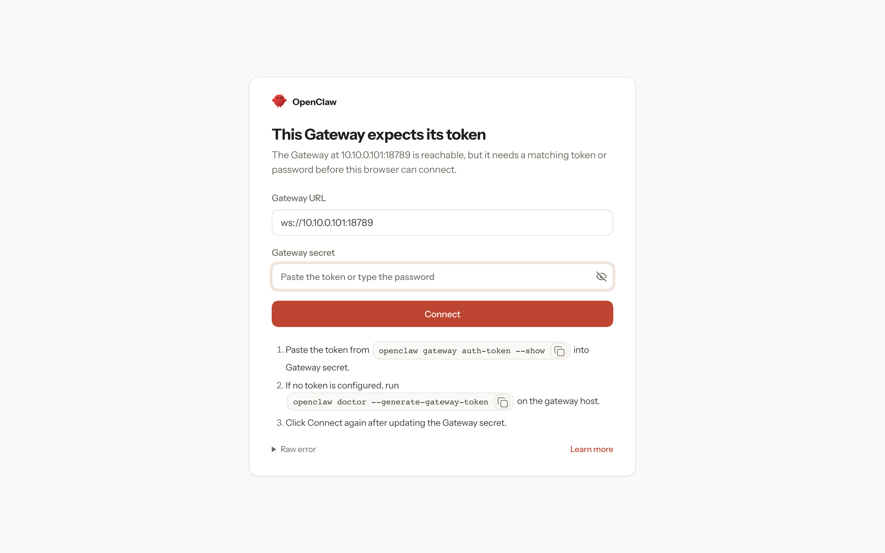
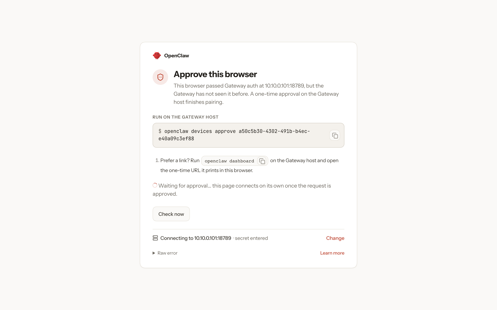
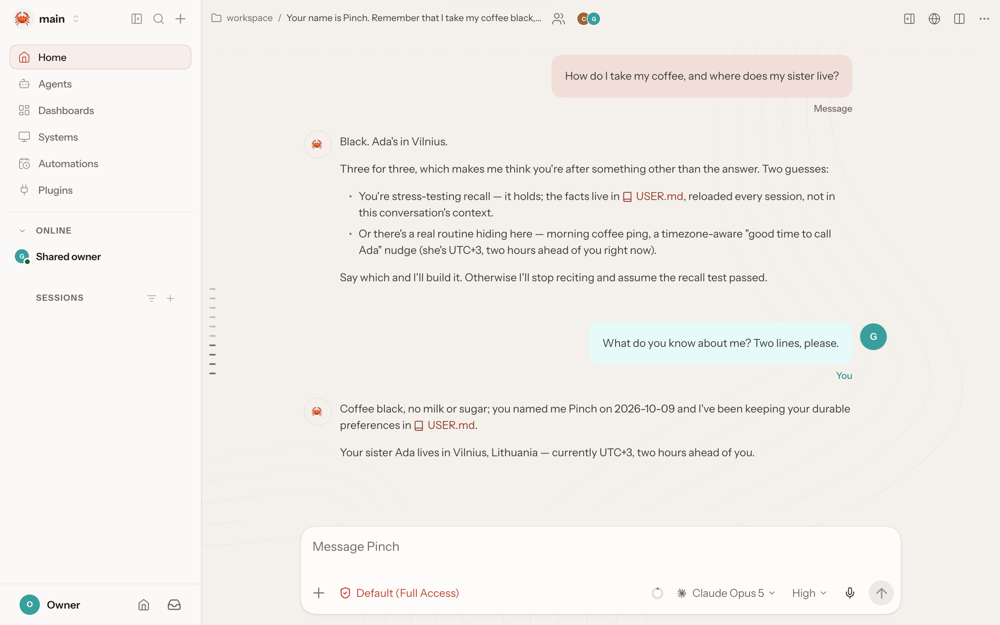

[OpenClaw](https://openclaw.ai) is a personal AI assistant that runs all the
time and does things for you on the machine it runs on. It runs commands,
writes files and keeps its memory there. That is best done on a machine of
its own. Here it gets one: an instance on a Dicer host, running OpenClaw's
official image, which it can use as it likes, and which a snapshot can put
back as it was.

## Start it

```console
$ dicer run -d --name openclaw --vcpus 2 --memory 4GiB --disk 20GiB \
    --restart always --health-http 18789/healthz --health-start-period 2m \
    -p 18789:18789 ghcr.io/openclaw/openclaw:2026.9.3 \
    sh -c 'openclaw doctor --fix --non-interactive; exec openclaw gateway --allow-unconfigured'
Instance openclaw started in 1s (172.20.55.87)
$ dicer wait --condition healthy --timeout 3m openclaw
```

The command runs `openclaw doctor`, which checks and repairs OpenClaw's
state, and then its gateway. `--allow-unconfigured` lets the gateway start
before it is set up. The start period gives `doctor` time to finish before
a failed health check counts.

OpenClaw keeps everything in `/root/.openclaw`, on the instance's own disk.
So it stays across restarts, and a snapshot holds all of it. Dicer runs the
image's workload as root: OpenClaw has the whole machine, and nothing else.

## Set it up

Give OpenClaw an Anthropic API key, and a token for its gateway:

```console
$ export ANTHROPIC_API_KEY=sk-ant-…
$ export OPENCLAW_GATEWAY_TOKEN=$(openssl rand -hex 24)
$ dicer exec -e ANTHROPIC_API_KEY -e OPENCLAW_GATEWAY_TOKEN openclaw sh -c '
    openclaw onboard --non-interactive --accept-risk --mode local \
      --auth-choice apiKey --anthropic-api-key "$ANTHROPIC_API_KEY" --secret-input-mode plaintext \
      --gateway-bind lan --gateway-auth token --gateway-token "$OPENCLAW_GATEWAY_TOKEN" \
      --skip-channels --skip-skills --skip-daemon --skip-health'
Workspace OK: ~/.openclaw/workspace
Sessions OK: ~/.openclaw/agents/main/sessions
Updated config: ~/.openclaw/openclaw.json
  Backup: ~/.openclaw/openclaw.json.bak
$ dicer restart openclaw
Instance openclaw restarted in 2.5s (172.20.55.87)
$ dicer wait --condition healthy --timeout 3m openclaw
$ dicer ps --wide --filter name=openclaw
NAME      IMAGE                               STATE    STATUS                   VCPU  MEMORY  DISK    NETWORK  IP            PORTS  CREATED
openclaw  ghcr.io/openclaw/openclaw:2026.9.3  Running  Up 20 seconds (healthy)  2     4 GiB   20 GiB  default  172.20.55.87  -      51 seconds ago
```

`dicer exec -e NAME` passes your shell's value of a variable, so neither
the key nor the token is written in the command. OpenClaw keeps the key in
its configuration, on its own disk. Keep the gateway token: its dashboard
asks for it. The gateway listens on the guest's own address, so that its
published port reaches it, and answers only with the token.

## Talk to it

```console
$ dicer exec openclaw openclaw agent --agent main \
    --message "Your name is Pinch. Remember that I take my coffee black, and that my sister Ada lives in Vilnius."
Pinch it is. 🦀

Locked in and written down:

- **Name + vibe** → `IDENTITY.md` and `SOUL.md`, and synced to config so channels and the UI show the same thing. Vibe line I picked: *dry, precise, a little mischievous; grabs the useful detail and doesn't let go.* Veto it and I'll rewrite.
- **Coffee: black.** No milk, no sugar — filed as a standing directive, not a one-off note.
- **Sister Ada, Vilnius.** Also filed.

No pending app recommendations from onboarding, so nothing to install. Bootstrap file is gone and the workspace is committed.

One note since it's day one: I run with real access to this machine — files, shell, whatever you connect next. Before you hook up channels or expose the Gateway to the network, skim https://docs.openclaw.ai/gateway/security; `openclaw security audit` will check the setup anytime.

Ask me anything; for system things I'll ask OpenClaw.
```

To talk to it from your phone, give it a channel, such as a
[Telegram bot](https://docs.openclaw.ai/channels/telegram/setup). Run
OpenClaw's commands through `dicer exec openclaw`, as above.

## Open its dashboard

`-p 18789:18789` publishes OpenClaw's dashboard on port 18789 of the host.
Open it at the host's address, here `http://10.10.0.101:18789/`, and give
it the gateway token:



The first time a browser connects, OpenClaw asks you to approve it:



Run the command it gives in the instance:

```console
$ dicer exec openclaw openclaw devices approve a50c5b30-4302-491b-b4ec-e40a09c3ef88
Approved d368e218e930b1fa0ea20b70d0235b8cc16f6413af9f597031d127bcd513c5ec (a50c5b30-4302-491b-b4ec-e40a09c3ef88)
```

The page connects on its own, and you can talk to Pinch there:



`-p 18789:18789` publishes the port on every address the host has. To keep
the dashboard off the internet, publish it on a private address only, such
as `-p 10.10.0.101:18789:18789`.

## Take snapshots

OpenClaw keeps everything on the instance's own disk, so a
[snapshot](../../guides/snapshots) holds the whole assistant, its memory and
configuration included. Take one before you let OpenClaw do something you
may want to undo, such as installing a skill or reorganising its files:

```console
$ dicer snapshot create openclaw before-cleanup
Snapshot before-cleanup of instance openclaw created in 3.2s (memory, 4.1 GiB)
```
